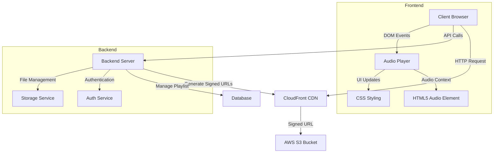

# Hot 'n Tasty Music Player

A modern, responsive web-based music player with cloud storage integration and mobile-friendly design.

## Features

- 🎵 Cloud-based audio streaming from AWS CloudFront
- 📱 Responsive design optimized for both desktop and mobile devices
- 🎨 Modern UI with custom controls and progress bar
- 🔄 Dynamic playlist management
- ⏯️ Playback controls:
  - Play/Pause
  - Next/Previous track
  - Fast forward/Rewind
  - Volume control
- 📊 Real-time progress tracking
- 🎶 Metadata display (track title, duration)
- 🔒 Secure signed URLs for audio access

## Architecture

## Technical Stack

- **Frontend:**
  - HTML5
  - CSS3 (with responsive design)
  - JavaScript (ES6+)
  - Font Awesome icons
  - Google Fonts (Roboto)

- **Backend:**
  - AWS CloudFront (CDN)
  - AWS S3 (Storage)
  - Signed URL authentication

## Setup Instructions

1. Clone the repository
2. Ensure you have the necessary AWS credentials configured
3. Update the CloudFront distribution URL in the configuration
4. Deploy the static files to your web server

## Mobile Optimization

The player is specifically optimized for mobile devices with:
- Touch-friendly controls
- Responsive layout
- iOS-specific fixes
- Optimized font sizes and spacing
- Sticky header and player controls

## Browser Support

- Chrome (latest)
- Firefox (latest)
- Safari (latest)
- Edge (latest)
- Mobile Safari (iOS)
- Chrome for Android

## Security Features

- Signed URL authentication for audio files
- Secure CloudFront distribution
- Protected S3 bucket access

## Contributing

1. Fork the repository
2. Create your feature branch
3. Commit your changes
4. Push to the branch
5. Create a new Pull Request

## License

This project is licensed under the MIT License - see the LICENSE file for details.
