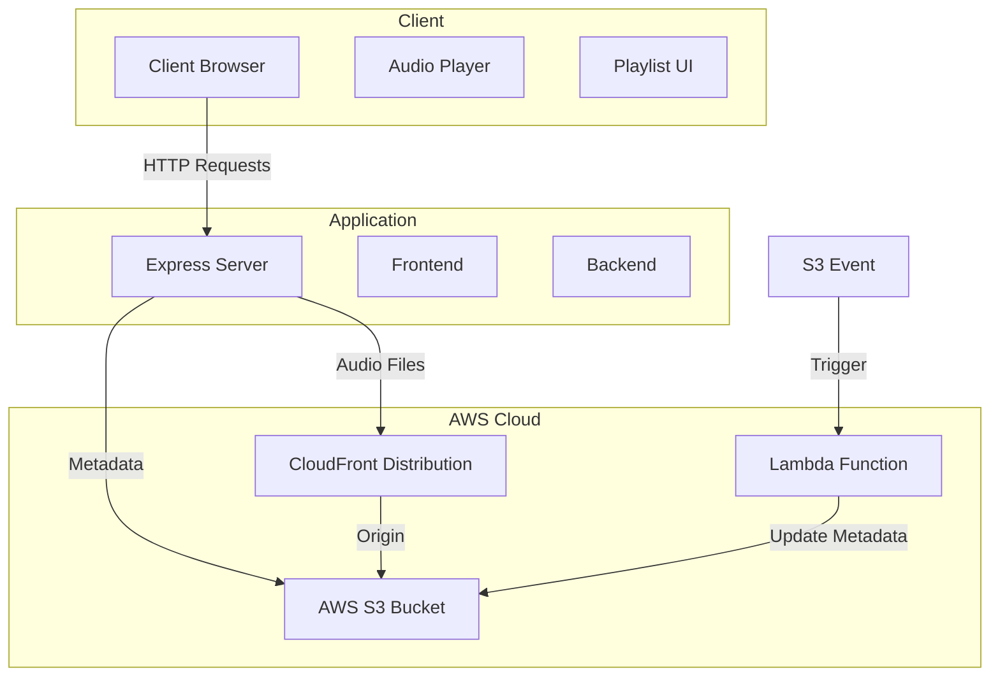

# daRealMusic

A modern music player application that allows users to stream music files directly from AWS S3 through CloudFront. The application features a responsive design, dynamic playlist management, and efficient audio streaming.

## Features

- Stream music files directly from AWS S3 through CloudFront
- Dynamic playlist management with automatic metadata updates
- Responsive design optimized for both desktop and mobile
- Cross-platform audio playback with iOS compatibility
- Real-time audio progress tracking
- Volume control and mute functionality
- Automatic playlist generation from S3 bucket contents
- Secure file access through CloudFront distribution

## Architecture



## Prerequisites

- Node.js 18 or higher
- AWS account with:
  - S3 access
  - CloudFront distribution
  - Lambda function permissions
- AWS Lightsail instance
- GitHub repository

## Environment Variables

Create a `.env` file in the root directory with the following variables:

```env
NODE_ENV=production
AWS_REGION=us-east-1
AWS_ACCESS_KEY_ID=your_access_key
AWS_SECRET_ACCESS_KEY=your_secret_key
S3_BUCKET_NAME=your-music-bucket
CLOUDFRONT_DOMAIN=your-cloudfront-domain.cloudfront.net
```

## Installation

1. Clone the repository:
```bash
git clone https://github.com/yourusername/daRealMusic.git
cd daRealMusic
```

2. Install dependencies:
```bash
npm install
```

3. Start the development server:
```bash
npm start
```

## Deployment

The application is deployed to AWS Lightsail using GitHub Actions. The deployment process is automated and triggered on every push to the main branch.

### Deployment Process

1. GitHub Actions workflow is triggered on push to main branch
2. Code is copied to the Lightsail instance
3. Systemd service is created and configured
4. Dependencies are installed
5. Application is started/restarted

### Required GitHub Secrets

Add these secrets to your GitHub repository:
- `LIGHTSAIL_HOST`: Your Lightsail instance's public IP
- `LIGHTSAIL_SSH_KEY`: Your Lightsail SSH private key
- `AWS_ACCESS_KEY_ID`: Your AWS access key
- `AWS_SECRET_ACCESS_KEY`: Your AWS secret key

### Deployment Directory Structure

The application is deployed to:
```
/opt/bitnami/apps/music-player/
```

### Systemd Service

The application runs as a systemd service with the following configuration:
- Service name: `music-player`
- User: `bitnami`
- Working directory: `/opt/bitnami/apps/music-player`
- Restart policy: `on-failure`

## Development

### Project Structure

```
daRealMusic/
├── .github/
│   └── workflows/
│       └── deploy.yml          # GitHub Actions deployment workflow
├── config/
│   └── aws.js                 # AWS configuration
├── public/
│   ├── css/
│   │   └── styles.css         # Stylesheet
│   ├── js/
│   │   └── realMusic.js       # Frontend JavaScript
│   └── index.html             # Main HTML file
├── .env                       # Environment variables
├── .gitignore                 # Git ignore file
├── index.js                   # Main server file
├── package.json               # Project dependencies
└── README.md                  # This file
```

## AWS Infrastructure

### S3 Bucket Configuration
- Public access blocked
- CORS enabled for CloudFront access
- Lifecycle rules for cost optimization

### CloudFront Distribution
- Origin pointing to S3 bucket
- CORS headers enabled
- Cache behavior optimized for audio streaming
- SSL/TLS encryption

### Lambda Function
- Triggered by S3 upload events
- Updates metadata file automatically
- Maintains playlist information

## Security Considerations

- AWS credentials are stored as GitHub secrets
- Environment variables are not committed to the repository
- CloudFront distribution provides secure access to S3 content
- CORS policies are properly configured
- S3 bucket permissions are properly configured

## Troubleshooting

### Common Issues

1. **Audio Playback Issues**
   - Check CloudFront distribution configuration
   - Verify CORS settings
   - Ensure proper audio format support

2. **Deployment Permission Errors**
   - Ensure the `bitnami` user has proper permissions
   - Check systemd service configuration

3. **AWS Connection Issues**
   - Verify AWS credentials
   - Check S3 bucket permissions
   - Confirm region settings
   - Validate CloudFront distribution

4. **Service Not Starting**
   - Check systemd logs: `sudo journalctl -u music-player`
   - Verify file permissions
   - Check application logs

## Contributing

1. Fork the repository
2. Create a feature branch
3. Commit your changes
4. Push to the branch
5. Create a Pull Request

## License

This project is licensed under the MIT License - see the LICENSE file for details.
