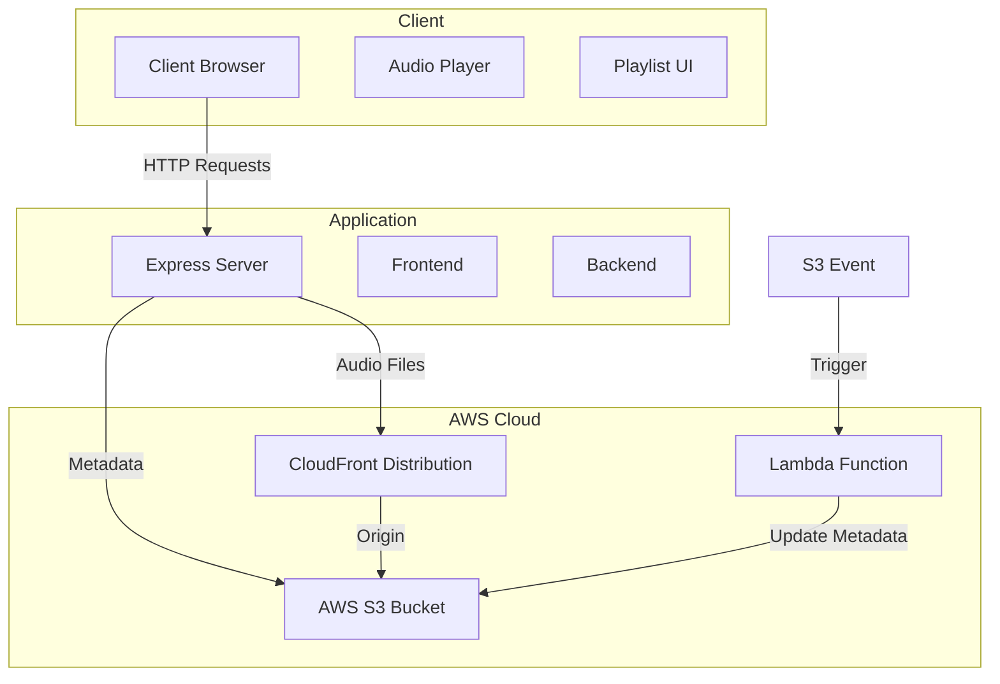

# daRealMusic

`daRealMusic` is a direct-to-fan music storefront and artist-owned listening experience. It lets an artist or imprint stream music from its own infrastructure, sell directly, capture fan intent, and route higher-value revenue like downloads, support payments, and licensing.

This should not be treated as “a better streaming app.” The strategic role of `daRealMusic` is to help artists own the customer relationship after discovery happens elsewhere.

## Business Position

The core business thesis is:

- DSPs are discovery rails, not the primary business
- artists need owned audience and direct monetization
- the winning unit of economics is revenue per fan, not stream count
- niche fan communities are more valuable than undifferentiated mass reach

For the fuller business plan, see [BUSINESS_PLAN.md](/Users/benjaminkeller/PLEROMA/MUSICTECH/daRealMusic/BUSINESS_PLAN.md).

## Features

- Stream music files directly from AWS S3 through CloudFront
- Artist-branded listening page
- Direct album and single purchase flows
- Pay-what-you-want support path
- Licensing inquiry capture
- Responsive design optimized for both desktop and mobile
- Cross-platform audio playback with iOS compatibility
- Real-time audio progress tracking
- Volume control and mute functionality
- Automatic playlist generation from S3 bucket contents
- Secure file access through CloudFront distribution

## Product Thesis

`daRealMusic` is best understood as a lightweight artist-commerce and fan-ownership layer.

Current wedge:

- artist microsite
- owned player
- direct digital sales
- support payments
- sync/licensing intake

Next wedge:

- Laylo-powered email/SMS capture
- supporter identity
- direct fan analytics
- premium bundles
- gated extras
- community routing, including Discord for high-intent fans

## Recommended External Integration

The fastest way to make `daRealMusic` commercially stronger is to integrate Laylo for:

- release-drop signups
- email and SMS capture
- reminders and reactivation
- campaign segmentation

Recommended operating model:

- `daRealMusic` is the owned storefront and listening experience
- Laylo handles opt-in capture and drop messaging
- fans are routed back to `daRealMusic` for purchase, support, and conversion

## Architecture


```mermaid
graph TD
    A[Client Browser] -->|HTTP Requests| B[Express Server]
    B -->|Metadata| C[AWS S3 Bucket]
    B -->|Audio Files| D[CloudFront Distribution]
    D -->|Origin| C
    E[Lambda Function] -->|Update Metadata| C
    F[S3 Event] -->|Trigger| E
    
    subgraph AWS Cloud
        C
        D
        E
    end
    
    subgraph Application
        B
        G[Frontend]
        H[Backend]
    end
    
    subgraph Client
        A
        I[Audio Player]
        J[Playlist UI]
    end
```

## Prerequisites

- Node.js 18 or higher
- AWS account with:
  - S3 access
  - CloudFront distribution
  - Lambda function permissions
- AWS Lightsail instance
- GitHub repository

## Environment Variables

Create a `.env` file in the root directory with the following variables:

```env
NODE_ENV=production
PORT=3000
AWS_REGION=us-east-2
AWS_ACCESS_KEY_ID=your_access_key
AWS_SECRET_ACCESS_KEY=your_secret_key
S3_BUCKET_NAME=your-music-bucket
CLOUDFRONT_DOMAIN=your-cloudfront-domain.cloudfront.net
ARTIST_NAME=Drainbow
RELEASE_TITLE=Life Under Bittherium
FAN_CAPTURE_MODE=laylo_redirect
CAMPAIGN_ID=life-under-bittherium-drop
CAMPAIGN_STATUS=collecting
RELEASE_DATE=
CAMPAIGN_HEADLINE=Join the drop and stay close to the release.
CAMPAIGN_GOAL_SIGNUPS=250
LAYLO_DROP_URL=https://laylo.com/your-drop
LAYLO_PROFILE_URL=https://laylo.com/your-profile
DISCORD_INVITE_URL=https://discord.gg/your-invite
```

`FAN_CAPTURE_MODE` works like this:

- `laylo_redirect`: capture the fan locally, then open the configured Laylo page
- `local`: keep the fan fully inside `daRealMusic` and store signup locally

## Owned Fan Funnel

The app now includes a first-pass owned-fan capture layer:

- `Join the Drop` CTAs open a capture modal
- the app stores local fan profiles and capture events
- if Laylo is configured, the user is sent to the Laylo drop/profile after capture
- Discord links can be configured from env and inherit attribution parameters

Local capture artifacts are written to:

- `data/subscribers.json`
- `data/fan-profiles.json`
- `data/fan-capture-events.json`

There is also a simple local reporting endpoint:

- `GET /api/fan-capture-report`

## Native Drop Campaigns

`daRealMusic` now has a native drop-campaign layer even without Laylo:

- campaign config is driven by env
- signup and buyer counts are computed locally
- the landing page surfaces campaign status and goal progress
- fan profiles are tagged by stage:
  - `listener`
  - `subscriber`
  - `buyer`
  - `supporter`
  - `patron`

Campaign endpoints:

- `GET /api/drop-campaign`
- `POST /api/drop-campaign`

Local campaign storage:

- `data/drop-campaigns.json`
- `data/fan-capture-events.json`
- `data/fan-profiles.json`

## Supporter Library

The app now also includes a lightweight supporter identity layer:

- successful purchases create or update a supporter profile
- supporters get a persistent library URL tied to their token
- the library shows:
  - purchase history
  - download links
  - supporter tier
  - next-step actions like drop signup or Discord

Artifacts are written locally to:

- `data/purchases.json`
- `data/supporters.json`

Supporter endpoints:

- `GET /api/download`
- `GET /api/redownload`
- `GET /api/supporter-library`

## Installation

1. Clone the repository:
```bash
git clone https://github.com/yourusername/daRealMusic.git
cd daRealMusic
```

2. Install dependencies:
```bash
npm install
```

3. Start the development server:
```bash
npm start
```

## Deployment

The application is deployed to AWS Lightsail using GitHub Actions. The deployment process is automated and triggered on every push to the main branch.

### Deployment Process

1. GitHub Actions workflow is triggered on push to main branch
2. Code is copied to the Lightsail instance
3. Systemd service is created and configured
4. Dependencies are installed
5. Application is started/restarted

### Required GitHub Secrets

Add these secrets to your GitHub repository:
- `LIGHTSAIL_HOST`: Your Lightsail instance's public IP
- `LIGHTSAIL_SSH_KEY`: Your Lightsail SSH private key
- `AWS_ACCESS_KEY_ID`: Your AWS access key
- `AWS_SECRET_ACCESS_KEY`: Your AWS secret key

### Deployment Directory Structure

The application is deployed to:
```
/opt/bitnami/apps/music-player/
```

### Systemd Service

The application runs as a systemd service with the following configuration:
- Service name: `music-player`
- User: `bitnami`
- Working directory: `/opt/bitnami/apps/music-player`
- Restart policy: `on-failure`

## Development

### Project Structure

```
daRealMusic/
├── .github/
│   └── workflows/
│       └── deploy.yml          # GitHub Actions deployment workflow
├── config/
│   └── aws.js                 # AWS configuration
├── public/
│   ├── css/
│   │   └── styles.css         # Stylesheet
│   ├── js/
│   │   └── realMusic.js       # Frontend JavaScript
│   └── index.html             # Main HTML file
├── .env                       # Environment variables
├── .gitignore                 # Git ignore file
├── index.js                   # Main server file
├── package.json               # Project dependencies
└── README.md                  # This file
```

## AWS Infrastructure

### S3 Bucket Configuration
- Public access blocked
- CORS enabled for CloudFront access
- Lifecycle rules for cost optimization

### CloudFront Distribution
- Origin pointing to S3 bucket
- CORS headers enabled
- Cache behavior optimized for audio streaming
- SSL/TLS encryption

### Lambda Function
- Triggered by S3 upload events
- Updates metadata file automatically
- Maintains playlist information

## Security Considerations

- AWS credentials are stored as GitHub secrets
- Environment variables are not committed to the repository
- CloudFront distribution provides secure access to S3 content
- CORS policies are properly configured
- S3 bucket permissions are properly configured

## Troubleshooting

### Common Issues

1. **Audio Playback Issues**
   - Check CloudFront distribution configuration
   - Verify CORS settings
   - Ensure proper audio format support

2. **Deployment Permission Errors**
   - Ensure the `bitnami` user has proper permissions
   - Check systemd service configuration

3. **AWS Connection Issues**
   - Verify AWS credentials
   - Check S3 bucket permissions
   - Confirm region settings
   - Validate CloudFront distribution

4. **Service Not Starting**
   - Check systemd logs: `sudo journalctl -u music-player`
   - Verify file permissions
   - Check application logs

## Contributing

1. Fork the repository
2. Create a feature branch
3. Commit your changes
4. Push to the branch
5. Create a Pull Request

## License

This project is licensed under the MIT License - see the LICENSE file for details.
